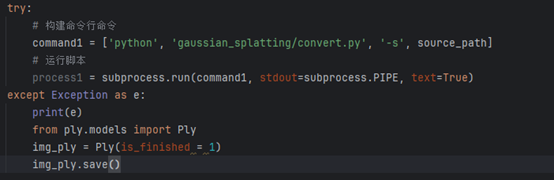
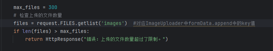

# WebGaussian

## 一.环境配置

**1.基础环境**  webgaussian运行需要配置3dgs所需要的环境。

```
cd backend/gaussian_splatting
conda create env --file environment.yml
```

**2.django后端 **  webgaussian后端是以django框架进行开发，以celery进行定时任务启动训练,redis作为消息中间件(任务队列)

```
conda activate webgaussian
pip install django
pip install celery
```

**3.配置Redis**    **https://github.com/tporadowski/redis/releases**

```
cd Redis
redis-server.exe  #启动Redis
```

在settings中设置broker URL

```
# 如果没有设置密码，可以省略密码部分.在本地运行 Redis，默认端口是6379.
# 如果 Redis 设置了密码： CELERY_BROKER_URL = 'redis://:password@localhost:6379/0'
CELERY_BROKER_URL = 'redis://127.0.0.1:6379/0'
CELERY_RESULT_BACKEND = 'redis://127.0.0.1:6379/1'
```

**4.数据库**  以mysql作为数据库存储用户上传数据，同时需要配置mysql并创建webgs数据库。

```
create database webgs;
```


## 二.启动服务

**1.启动celery worker和beat**

```
conda activate webgaussian
cd backend
celery -A backend worker -l info -P eventlet  #启动celery worker
celery -A backend beat -l info    #启动celery beat
```

**2.启动redis**  celery beat进行任务调度，定时将任务id装载进redis队列中。worker在队列的另一端取出任务id，并匹配当前注册的任务。

```
cd Redis //也可以将redis路径放到环境变量path中，就不需要进入路径，可以直接输入指令
redis-server.exe 
```

**3.启动服务器**

```
cd backend
python manage.py runserver
```

**4.前端node.js**

```
npm init #生成package.json
npm install #node_modules
```

可以写一个bat脚本来直接启动，将path改为自己的路径

```
#start.bat
::窗口1启动server
start cmd /k "activate webgaussian && d: && cd path\webapp\backend && python manage.py runserver"
::窗口2 启动celery worker
start cmd /k "activate webgaussian && d: && cd path\webapp\backend && celery -A backend worker -l info -P eventlet"
::窗口3 启动celery beat
start cmd /k "activate webgaussian && d: && cd path\webapp\backend && celery -A backend beat -l info"
::窗口4 启动redis
start cmd /k "redis-server.exe"    
```


# 问题&解决

### 1.图片输入过少会创建文件夹，但是有可能无法进行COLMAP，数据库信息存在，导致无法处理。



​	COLMAP指令报错，将模型的建模状态改为1，完成的状态，先忽略，处理剩余的内容。

​	***Todo：1.在ply类里添加属性。显示模型更多状态。***

### 2.settings.DATA_UPLOAD_MAX_NUMBER_FILES.=100 图片输入过多，上限设置为300。同时会先创建文件夹，但上传数量超出上限，上传不到数据库，会出现空文件夹的情况。

​					

​	先检查文件上传数量再创建文件夹。如果超出上限就报错返回。
